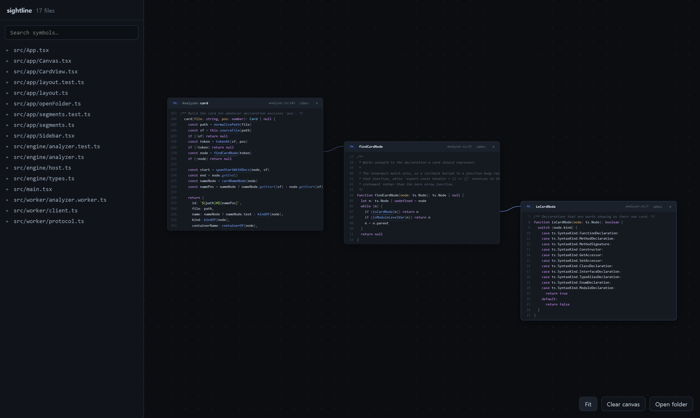

# Sightline

Read a codebase as a chain of functions, not a stack of tabs.



Open one function. Click a call inside it, and the callee lands beside it — wired back to
the exact line it was called from. Follow a call chain across files and keep every step on
screen at once, instead of losing the thread three "go to definition" jumps deep.

Everything runs in the browser. Your code is never uploaded, because there is no server to
upload it to.

## Why this exists

The idea isn't new. [Code Bubbles](http://andrewbragdon.com/papers/p1064-213-deline.pdf)
(Brown, 2010) showed that seeing many functions at once measurably cuts navigation time,
and Microsoft shipped it as Debugger Canvas in 2011. Both are gone. Sourcetrail, the best
free code explorer of the last decade, was discontinued in 2021. What survives is a paid
Visual Studio extension and a scattering of tools that emit static SVG call graphs — which
is a picture of the code, not a place to read it.

Meanwhile the problem got worse: more of the code any of us touch is code we didn't write.

## What makes the navigation real

Anything can underline identifiers. The work is in resolving them correctly, and that is
where a heuristic parser quietly falls apart. Sightline runs the **actual TypeScript
language service** in a Web Worker over an in-memory filesystem, so it resolves what your
editor resolves:

- **Imported symbols reach their real declaration.** `getDefinitionAtPosition` stops at the
  local import alias, so following it would land you on an `import` statement instead of the
  function. Sightline goes through the type checker and unwraps the alias.
- **Method calls resolve through the receiver's type**, including receivers whose type only
  survives because of the standard library — `names.map(make).map(u => u.greet())` finds
  `greet` in the file that declares it.
- **Callers work in reverse.** Any card can ask who calls it, and the answer opens to the
  *left*, so a chain assembled from either end still reads in call order.

The standard library is bundled for a measured reason: with no `lib.d.ts` loaded, three of
four everyday patterns (`.map()`, `await`, spread) lose the receiver's type and stop
resolving. DOM definitions are deliberately excluded — they cost 3 MB and resolve nothing
extra, since DOM declarations live outside your project and are reported as external either
way. The bundle is 57 files, 50 KB gzipped.

## Running it

```bash
npm install
npm run dev      # http://localhost:5173
npm test         # engine, segmentation and layout tests
npm run build
```

The demo project is Sightline's own source, so it can never drift out of date.

To read your own code, click **Open a folder**. In Chromium browsers this uses the File
System Access API; elsewhere it falls back to a directory input. Either way the files are
read locally and never leave the page.

## Limits

Worth knowing before you judge a result:

- **TypeScript and JavaScript only.** The resolution quality comes from the TypeScript
  compiler, and that is what it understands.
- **`node_modules` is not loaded.** Symbols from your dependencies resolve as *external* and
  are shown dimmed rather than opened. Your own code is fully resolved.
- **`.d.ts` files are skipped** when reading a folder, along with the usual build and vendor
  directories.
- **Large projects are capped** at 4000 files / 24 MB, and the canvas tells you when it
  skipped something.

## How it's put together

```
src/engine/    host.ts       in-memory LanguageServiceHost (never delegates to ts.sys)
               analyzer.ts   cards, links, callers, search
src/worker/    the language service, off the UI thread
src/app/       canvas, cards, layout and highlight segmentation
scripts/       build-libs.mjs — the minimal lib.d.ts closure
```

The engine is plain TypeScript with no DOM dependency, which is why it is tested directly.
